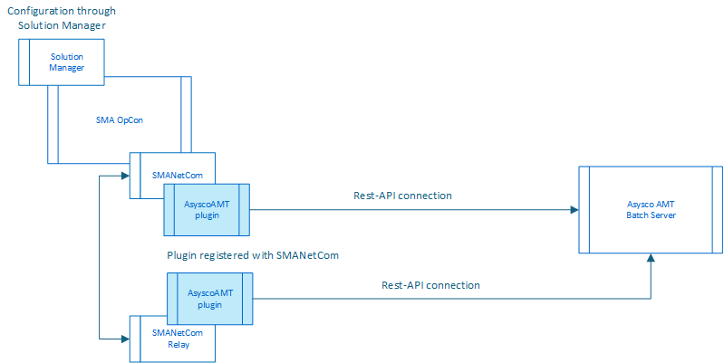

# Asysco AMT ACS Plugin

The Asysco LION environment includes a basic scheduler that is used to schedule batch runs. The information is defined and driven from within the Asysco environment. 

The SMA OpCon Asysco AMT ACS Integration is a joint development between SMA and Asysco and has been designed to provide a tight connection between the SMA OpCon environment and the Asysco LION environment allowing OpCon to manage the scheduling of the batch processes.

The ACS (Agentless Connector System) consists of a plugin that provides the integration with external applications. The plugin is detected by the SMA software and automatically registered within the OpCon system. Once registered with the OpCon system it is available for configuration and use. The ACS Asysco Amt plugin is loaded into the OpCon SMANetCom environment and communicates directly with the Asysco AMT Batch Server through the defined Rest-API.  

The above diagram shows the relationship between the plugin module and the opCon Components. The plugin is placed in the plugin directory where it is detected by the SMANetCom module and registered with the OpCOn system. Once registered the OpCon system it is possible to configure the link between the OpCon system and the Asysco AMT Batch server and then defines workflows and tasks. 

All job definitions are defined in the AMT environment and performed by the AMT Batch Scheduler. OpCon is therefore scheduling predefined jobs and scripts.
The OpCon AMT ACS inserts the job execution definitions into the OpCon database and then passes the request to the AMT Batch Server where it is placed on a Scheduler queue. 
The OpCon AMT ACS then monitors the status of the job that is being executed by the AMT Batch Scheduler. 
Once the job is completed, the OpCon AMT ACS retrieves the job log information making it available via JORS. 

## AMTOpCon Interface
The AMTOpCon Interface is a restful Web Services implementation that provides the functions allowing OpCon to interact directly with the AMT Batch environment. 
The interface includes the following functions:

- **OpConJobAction**	Function to Start, Stop or Kill an AMT Batch task. During the Start it it is possible to pass parameters and TaskValues defined within OpCon to the AMT environment.
- **MonitorJob**		Function to monitor the status of a started job.
- **GetMessages**		Function to retrieve the messages associated with the job. As a job processes any messages generated by the job are written to the database. When the job completes the messages are retrieved and added to the OpCon job log making the information available via JORS. 
