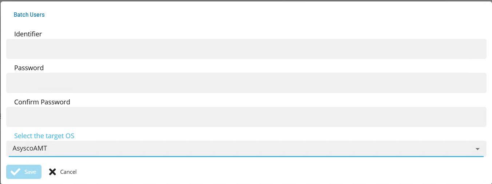
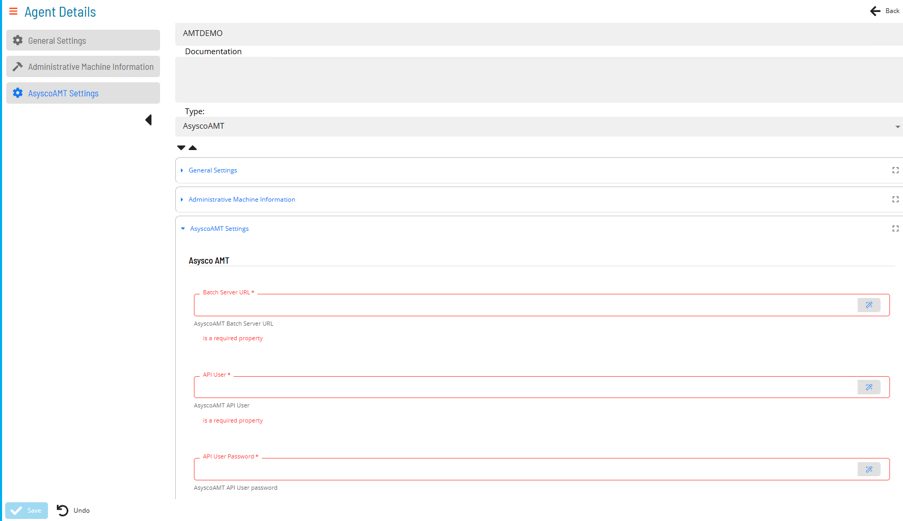
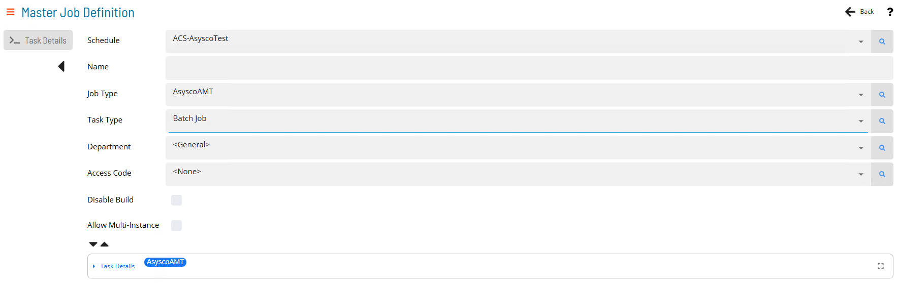
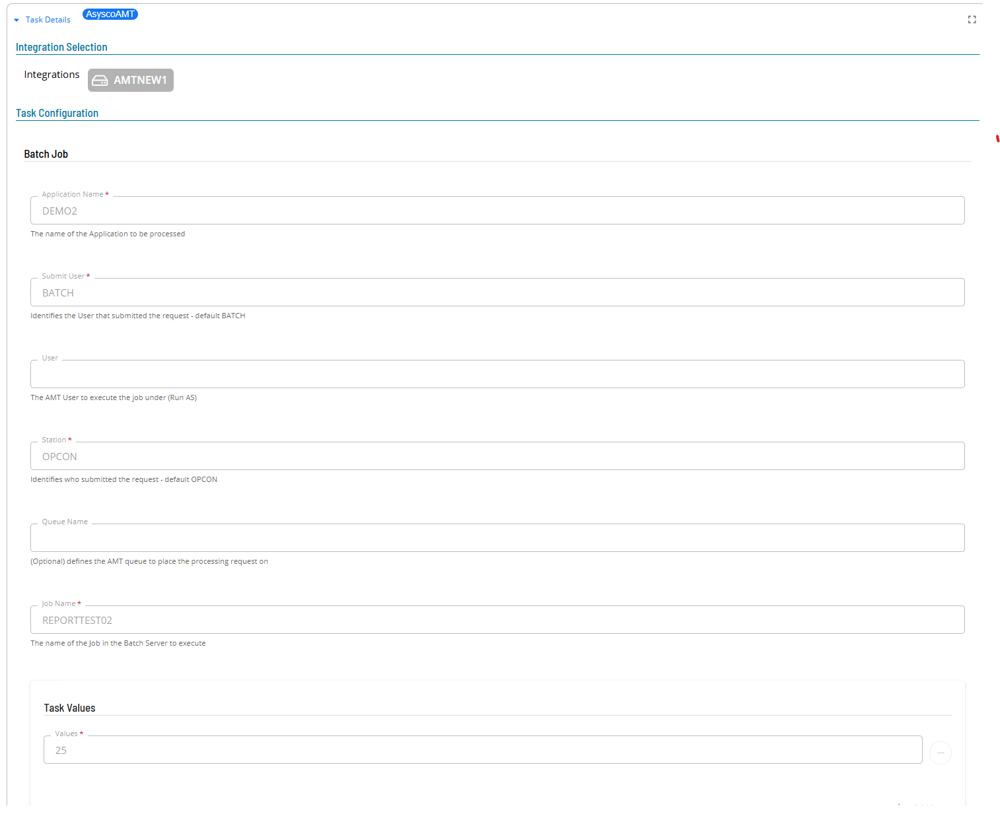
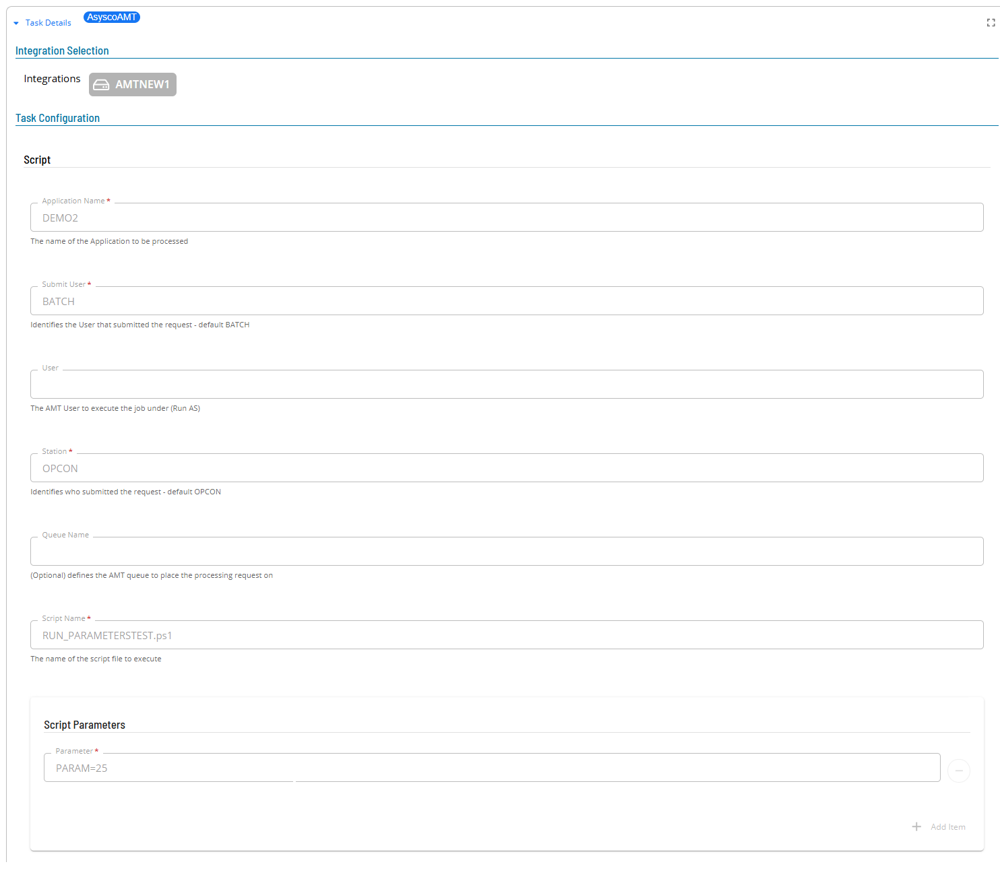

# Operation

**Theme:** Configure | **Audience:** System Administrator, Automation Engineer

## What is it?

Once the connector has been registered with the OpCon system, you can define the link between the OpCon system and the AMT Batch Server. Once the link is defined and active, you can define Asysco AMT tasks that are submitted to the AMT Batch Server through the REST-API. All definitions can only be performed using Solution Manager.

Use this page when:

- You are setting up the link between OpCon and an AsyscoAMT Batch Server for the first time.
- You need to define AMT batch jobs and scripts as OpCon-managed tasks with scheduling and dependency control.
- You want to monitor AMT job status and retrieve execution logs from within OpCon.

## Defining AsyscoAMT Batch Server connection

Before defining a communications link, an **AsyscoAMT** Batch User must first be created.

To add an AsyscoAMT Batch User, complete the following steps:

1. Open Solution Manager.
2. From the **Home** page, select **Library**.
3. From the **Security** menu, select **Batch Users**.
4. Select the **+Add** button.
5. Select **AsyscoAMT** from the **Select the target OS** list.
6. In the **Identifier** field, enter the API user name used to retrieve an authentication token.
7. In the **Password** field, enter the password.
8. In the **Confirm** field, enter the password again.
9. Select the **Save** button. The Batch User is saved.

The link between the OpCon system and the AsyscoAMT Batch Server is defined by adding a new AsyscoAMT agent definition using Solution Manager.

**NOTE:** Fields marked in red are required.

To define an AsyscoAMT agent connection, complete the following steps:

1. Open Solution Manager.
2. From the **Home** page, select **Library**.
3. From the **Administration** menu, select **Agents**.
4. Select the **+Add** button.
5. In the **Name** field, enter a unique name for the connection.
6. Select **AsyscoAMT** from the **Type** list.
7. Select **AsyscoAMT Settings**.
8. In the **Batch Server URL** field, enter the URL of the AMT Batch Server including the port number (for example, `http://BatchServer:42000`).
9. Select the API user from the **Batch User** list.
10. In the **Retain Log Files** field, enter the number of days to keep job log files. The default is 30 days.
11. Select the **Save** button.
12. Select the **Change Communication Status** button and select **Enable Full Comm.**
13. Select **Administrative Machine Information**.
14. Set the **Allow Kill Job** field to **True**.
15. Select the **Save** button.
16. Select **Communication Settings**.
17. Confirm the **Requires XML Escape Sequences: User-Defined** field is set to **True**. If it is not, update the field and select the **Save** button.

The agent connection to the AsyscoAMT Batch Server is active.

## Defining tasks

The AsyscoAMT Connection supports two task types: **Batch Job** and **Script**.

To create an AsyscoAMT job, complete the following steps:

1. Open Solution Manager.
2. From the **Home** page, select **Library**.
3. From the **Administration** menu, select **Master Jobs**.
4. Select the **+Add** button.
5. Select the schedule name from the **Schedule** list.
6. In the **Name** field, enter a unique name for the job within the schedule.
7. Select **AsyscoAMT** from the **Job Type** list.
8. Select the task type from the **Task Type** list.

### Batch job

**NOTE:** Fields marked in red are required.

To configure the Batch Job task type, complete the following steps:

1. Select the **Task Details** button.
2. In the **Integration Selection** section, select the primary integration, which is an AsyscoAMT connection previously defined.
3. In the **Application Name** field, enter the AMT Application Name. Most implementations have a single application installed with the AMT environment.
4. Confirm the **Submit User** field is set to **BATCH**. Do not change this default value.
5. (Optional) In the **User** field, enter the user that the AMT task will run as within the AMT Batch environment (RunAS). If not defined, the Application user is used.
6. Confirm the **Station** field is set to **OPCON**. Do not change this default value.
7. (Optional) In the **Queue Name** field, enter the queue within the AMT Batch Server where the task should be placed. If not defined, the AMT Batch Server default queue is used.
8. In the **Job Name** field, enter the name of the task defined in the Asysco AMT Batch Server to execute.
9. In the **Task Values** field, enter task values used to modify, override, or elaborate existing task attributes that apply to the job. For each task value, select the **+ Add Item** button and enter the value.

The job is saved and ready for scheduling.

### Script

**NOTE:** Fields marked in red are required.

To configure the Script task type, complete the following steps:

1. Select the **Task Details** button.
2. In the **Integration Selection** section, select the primary integration, which is an AsyscoAMT connection previously defined.
3. In the **Application Name** field, enter the AMT Application Name. Most implementations have a single application installed with the AMT environment.
4. Confirm the **Submit User** field is set to **BATCH**. Do not change this default value.
5. (Optional) In the **User** field, enter the user that the AMT task will run as within the AMT Batch environment (RunAS). If not defined, the Application user is used.
6. Confirm the **Station** field is set to **OPCON**. Do not change this default value.
7. (Optional) In the **Queue Name** field, enter the queue within the AMT Batch Server where the task should be placed. If not defined, the AMT Batch Server default queue is used.
8. In the **Script Name** field, enter the name of the script to execute on the Asysco AMT Batch Server.
9. In the **Script Parameters** field, enter parameters to be passed to the task. Values are defined as name=value pairs. For each parameter, select the **+ Add Item** button and enter the parameter.

The job is saved and ready for scheduling.

## Configuration options

### Batch User settings

| Setting | What It Does | Default | Notes |
|---|---|---|---|
| Target OS | OS type for the batch user | — | Must be set to **AsyscoAMT** |
| Identifier | API user name used to retrieve an authentication token | — | Required |
| Password | Password for the API user | — | Required; stored encrypted |

### Agent connection settings

| Setting | What It Does | Default | Notes |
|---|---|---|---|
| Name | Unique identifier for the connection within OpCon | — | Required |
| Type | Agent type selector | — | Must be set to **AsyscoAMT** |
| Batch Server URL | URL of the AsyscoAMT Batch Server including the port number | — | Required; for example, `http://BatchServer:42000` |
| Batch User | API user credential for authenticating with the AMT Batch Server | — | Required |
| Retain Log Files | Number of days to keep job log files | 30 | — |
| Allow Kill Job | Enables the ability to terminate a running task from OpCon | — | Must be set to **True** |
| Requires XML Escape Sequences | Ensures special characters in job parameters are properly escaped | — | Must be set to **True** |

### Common job settings (Batch Job and Script)

| Setting | What It Does | Default | Notes |
|---|---|---|---|
| Integration Selection | Selects the AsyscoAMT agent connection to use | — | Required |
| Application Name | AMT Application Name for the target environment | — | Required |
| Submit User | User that submits the job to the AMT Batch Server | BATCH | Do not change this value |
| User | AMT user the task runs as within the AMT Batch environment (RunAS) | Application user | Optional |
| Station | Identifies the submitting system within AMT | OPCON | Do not change this value |
| Queue Name | AMT Batch Server queue where the task is placed | AMT default queue | Optional |

### Batch Job settings

| Setting | What It Does | Default | Notes |
|---|---|---|---|
| Job Name | Name of the task defined in the AMT Batch Server to execute | — | Required |
| Task Values | Name=value pairs that modify, override, or elaborate existing task attributes | — | Optional; add one value per row |

### Script settings

| Setting | What It Does | Default | Notes |
|---|---|---|---|
| Script Name | Name of the script to execute on the AMT Batch Server | — | Required |
| Script Parameters | Parameters passed to the script as name=value pairs | — | Optional; add one parameter per row |

**Related topics:**

- [Reference](./reference.md)
- [Overview](./overview.md)
