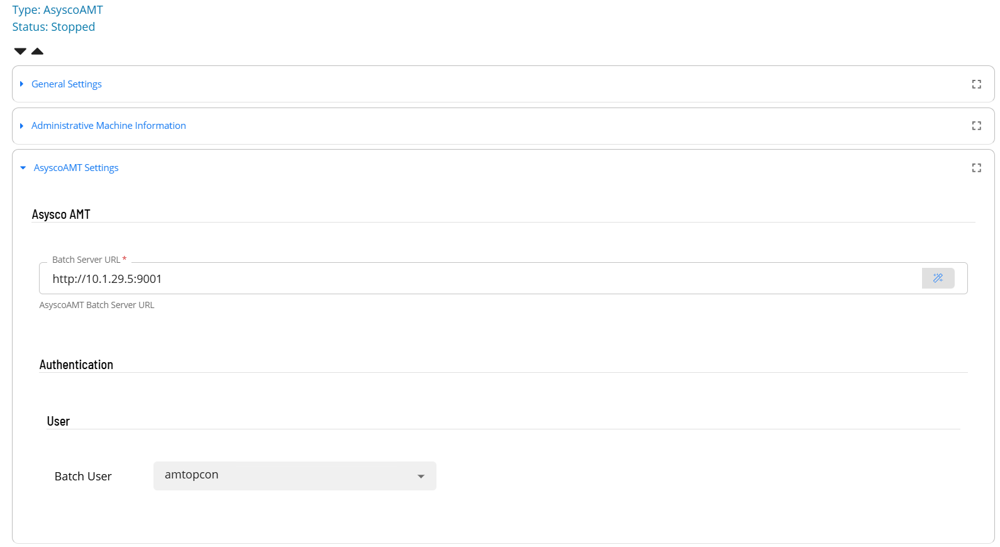

# Operation

Once the plugin has been registered with the OpCon system, it will be possible to define the link between the OpCon system and the AMT Batch Server. 
Once the link is defined and active, it will be possible to define Asysco AMT tasks that are submitted to the AMT Batch Server through the Rest-API. 
All definitions can only be performed using Solution Manager.

## Defining AsyscoAMT Batch Server connection

Before defining a communications link an **AsyscoAMT** Batch User must first be created. 


1.  Open Solution Manager.
2.  From the Home page select **Library**
3.  From the ***Security*** Menu select **Batch Users**.
4.  Select **+Add** to add a new Batch User.
5.  Select **AsyscoAMT** from the ***Select the target OS*** drop-down list.
6.  Enter the the API User name that will be used to retrieve an authentication token in the **Identifier** field.
7.  Enter the password of the defined API User in the **Password** and **Confirm** fields.
8.  Select **Save**.

The link between the OpCon System and the AsyscoAMT Batch Server is defined by adding a new AsyscoAMT Agent definition using Solution Manager.
Items defined in red are required values.



1.  Open Solution Manager.
2.  From the Home page select **Library**
3.  From the ***Administration*** Menu select **Agents**.
4.  Select **+Add** to add a new agent definition.
5.  Fill in the agent details
    - Insert a unique name for the connection.
    - Select **AsyscoAMT** from the **Type** drop-down list.
    - Select **AsyscoAMT Settings**
    - In the **Batch Server URL** field enter the url of the AMT Batch Server including the port number (i.e. http://BatchServer:42000).
    - Select the API User from the **Batch User** drop-down list.
    - In the **Retain Log Files** field define the number of days to keep job log files (default is 30 days). 
6.  Save the definition changes. 
7.  Start the connection by selecting the **Change Communication Status** button and selecting **Enable Full Comm.**
8.  Now select **Administrative Machine Information**
9.  Set the **Allow Kill Job** to **True**.
10. Save the definition changes. 

## Defining tasks

The AsyscoAMT Connection supports tow task types **Batch Job** and **Script**.


1.  Open Solution Manager.
2.  From the Home page select **Library**
3.  From the ***Administration*** Menu select **Master Jobs**.
4.  Select **+Add** to add a new master job definition.
5.  Fill in the task details.
    - Select the **Schedule** name from the drop-down list.
    - In the **Name** field enter a unique name for the task within the schedule.
    - Select **AsyscoAMT** from the **Job Type** drop-down list.
    - Select the task type from the **Task Type** drop-down list.

Enter details for Task Type **Batch Job**. 
Items defined in red are required values.


1.  Select the **Task Details** button.
2.  In the **Integration Selection** section, select the primary integration which is an AsyscoAMT connection previously defined.
3.  In the **Application Name** field enter the AMT Application Name. Most implementations have a single application installed with the AMT Environment.
4.  The **Submit User** field defines the name of the user that submits the request to the AMT Batch Server. It contains a default value of **BATCH** which should not be changed.
5.  The **User** field is an optional field that defines the user that the AMT Task will execute under within the AMT Batch environment (also known as RunAS). If not defined the Application user will be used.
6.  The **Station** field defines who submitted the request to the AMT Batch Server. It contains a default value of **OPCON** which should not be changed.
5.  The **Queue Name** field is an optional field that defines which queue within the AMT Batch server the task should be placed on. If not defined the AMT Batch server default queue will be used.
6.  In the **Job Name** field enter the name of the task defined in the Asysco AMT Batch server to execute.
7.  In the **Task Values** field enter Task values used to modify, override, or elaborate existing task attributes that apply to the job.
    - for each task value definition select **+ Add Item** and enter the value. 

Enter details for Task Type **Script**. 
Items defined in red are required values.


1.  Select the **Task Details** button.
2.  In the **Integration Selection** section, select the primary integration which is an AsyscoAMT connection previously defined.
3.  In the **Application Name** field enter the AMT Application Name. Most implementations have a single application installed with the AMT Environment.
4.  The **Submit User** field defines the name of the user that submits the request to the AMT Batch Server. It contains a default value of **BATCH** which should not be changed.
5.  The **User** field is an optional field that defines the user that the AMT Task will execute under within the AMT Batch environment (also known as RunAS). If not defined the Application user will be used.
6.  The **Station** field defines who submitted the request to the AMT Batch Server. It contains a default value of **OPCON** which should not be changed.
5.  The **Queue Name** field is an optional field that defines which queue within the AMT Batch server the task should be placed on. If not defined the AMT Batch server default queue will be used.
6.  In the **Script Name** field enter the name of the script to execute on the Asysco AMT Batch Server.
7.  In the **Script Parameters** field enter parameters to be passed to the task. Values are defined as name=value pairs.
    - for each parameter definition select **+ Add Item** and enter the parameter. 

## Failure Criteria
The Asysco AMT ACS integration returns a success or failure completion status. The actual Asysco AMT Completion code is displayed in the JobLog.
Error information about a task execution will also be displayed in the JobLog.

```
Completion Codes

0	IDLE                   Job is idle.
1	QUEUED                 Job is queued for future start in current timeframe.
2	RUNNING                Job was started manually or by the scheduler.
3	KILLED                 Job was terminated by a 'kill' command.
4	DONE                   Job completed normally.
5	SUSPENDED              Queued job has not started on time.
6	SKIPPED_BY_OPS         Suspended Job has been skipped by control center.
7	RUN_MANUAL             Job was started by control center.
8	RUN_FORCED             Forced start manual, start this job even when job server halted.
9	RUN_DEBUG              When a report is started from Visual Studio.
10	DEL_QUEUE              Job is deleted from queue.
11	ERROR                  Job Ended in Error. When executing a script and the script does not exist, an error code of 11 will be returned with a description of ‘File not found’.
12	ABORTED                The Job was aborted on purpose in the business-logic.
13	WAIT FOR FILE          Waiting for a file.
14	WAIT FOR INPUT REQUEST Waiting for Request.
15	WAIT FOR JOB           Waiting for another job to finish.
16	WAIT FOR REPORT        Waiting for a report to finish, for future use.
18	RECOVER_CP             This job (report) is a request to recover from a saved critical point.
19	UNDEFINED              State is undefined.
20	WAIT_FOR QUEUE         Waiting for queue start time.
21	WAIT_FOR_DEBUGGER      Waiting for a LION Debugger to start debug session for the job.
22	ABORTED_WITH_RECOVER   Aborted with recover.
23	WEB_SERVER_ERROR
24	AUTHENTICATION_ERROR
99	INVALID AMT USER       When executing an AMT script with a named AMT user and the user is invalid.

```
## Kill Job
The Asysco AMT ACS integration supports the ability to terminate a task within the Asysco AMT Batch Server. When the **Kill** task status is selected within OpCon an immediate kill request for the task is submitted to the AsyscoAMT Batch server.

## Job Log
When a task is executing within the AMT Environment, the job log is written to the database. This includes the information about the task as well as any children of the task. 
When the task completes the ACS Integration retrieves the information from the database and adds it to the job log of the OpCon job making it available via the JORS System.
It should be noted that JobLogs for Asysco AMT ACS integration tasks can only be viewed from within the Solution Manager environment.

```
---------------------------------------------------------------------------
Job Information -----------------------------------------------------------
Server          : http://10.1.29.5:9001
Application     : DEMO2
Submit User     : BATCH
Station         : OPCON
Queue Name      : 
Batch Job       : REPORTTEST01
Parameters      :
---------------------------------------------------------------------------
Completion Code : DONE
---------------------------------------------------------------------------
Job Log -------------------------------------------------------------------
"Started Rev: 1.3 AMT: 8.0.24223.0. Params: LOADINBATCHCONTROLLER /R:4280 /USEWORKINGDIR"
"Report test 01 is started"
"Report test 01 user BATCH"
"Report test 01 Value param []"
"Report test 01 is running 0 seconds"
"Report test 01 is running 10 seconds"
"Report test 01 is running 20 seconds"
"Report test 01 test is ended"
"Report execution time: 00:00:30:229"
"Done"
---------------------------------------------------------------------------

```

```
---------------------------------------------------------------------------
Job Information -----------------------------------------------------------
Server          : http://10.1.29.5:9001
Application     : DEMO2
Submit User     : BATCH
Station         : OPCON
Queue Name      : 
Script Job      : F:\Amt\Scripts\DEMO2\RUN_FILENAMETEST.ps1
Parameters      :
---------------------------------------------------------------------------
Completion Code : ERROR
---------------------------------------------------------------------------
Job Log -------------------------------------------------------------------
"Error starting job []"
"[An error occurred trying to start process 'pwsh' with working directory 'F:\\AMT\\SCRIPTS\\DEMO2'. The system cannot find the file specified.]"
---------------------------------------------------------------------------

```

```
---------------------------------------------------------------------------
Job Information -----------------------------------------------------------
Server          : http://10.1.29.5:9001
Application     : DEMO2
Submit User     : BATCH
Station         : OPCON
Queue Name      : 
Batch Job       : LONGRUNNINGREPORT
Parameters      :
---------------------------------------------------------------------------
Completion Code : KILLED
---------------------------------------------------------------------------
Job Log -------------------------------------------------------------------
---------------------------------------------------------------------------
```
