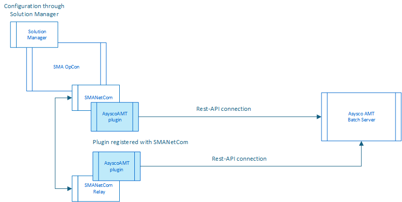

# AsyscoAMT ACS Connector

**Theme:** Overview | **Audience:** System Administrator, Automation Engineer

## What is it?

The SMA OpCon AsyscoAMT ACS Integration connects the SMA OpCon environment to the Asysco LION environment, allowing OpCon to manage the scheduling of batch processes. The Asysco LION environment includes a basic scheduler used to schedule batch runs, with information defined and driven from within the Asysco environment.

The ACS (Agentless Connector System) consists of a connector that provides the integration with external applications. The connector is detected by the SMA software and automatically registered within the OpCon system. Once registered with the OpCon system, it is available for configuration and use. The ACS AsyscoAMT connector is loaded into the OpCon SMANetCom environment and communicates directly with the AsyscoAMT Batch Server through the defined REST-API.

Use the AsyscoAMT ACS connector when:

- You need to schedule and monitor AsyscoAMT batch processes from within OpCon, replacing manual AMT scheduling with dependency-aware automation.
- You need to submit AMT batch jobs and scripts on demand or on a schedule without logging into the AMT Batch Server directly.
- You want to retrieve AMT job execution logs through JORS without accessing the AMT environment separately.

The diagram above shows the relationship between the connector module and the OpCon components. The connector is placed in the plugins directory where it is detected by the SMANetCom module and registered with the OpCon system. Once registered with the OpCon system, you can configure the link between the OpCon system and the AsyscoAMT Batch Server and define schedules and jobs.

Job definitions are stored in the AMT environment and performed by the AMT Batch Scheduler. OpCon schedules predefined jobs and scripts. The OpCon AMT ACS inserts the job execution definitions into the OpCon database and then passes the request to the AMT Batch Server where it is placed on a scheduler queue. The OpCon AMT ACS then monitors the status of the job being executed by the AMT Batch Scheduler. Once the job is completed, the OpCon AMT ACS retrieves the job log information, making it available via JORS.

## AMTOpCon interface

The AMTOpCon Interface is a RESTful web services implementation that provides the functions allowing OpCon to interact directly with the AMT Batch environment. The interface includes the following functions:

- **OpConJobAction** — Function to Start, Stop, or Kill an AMT Batch task. During the Start, it is possible to pass parameters and TaskValues defined within OpCon to the AMT environment
- **MonitorJob** — Function to monitor the status of a started job
- **GetMessages** — Function to retrieve the messages associated with the job. As a job processes, any messages generated by the job are written to the database. When the job completes, the messages are retrieved and added to the OpCon job log, making the information available via JORS

## Glossary

**AMT Batch Server** — The Asysco LION component that receives, queues, and executes batch jobs and scripts. The AsyscoAMT ACS connector communicates with the server through its REST-API.

**ACS (Agentless Connector System)** — The OpCon framework for integrating external applications without installing an agent on the target system. Connectors are loaded into SMANetCom or Relay and registered automatically with OpCon.

**JORS (Job Output Retrieval System)** — The OpCon service that provides access to job logs after a task completes. AsyscoAMT job logs are retrieved from the AMT database and made available through JORS.

**SMANetCom** — The OpCon network communications component that hosts ACS connectors and manages agent communications.

**Related topics:**

- [Installation](./installation.md)
- [Operation](./operation.md)
